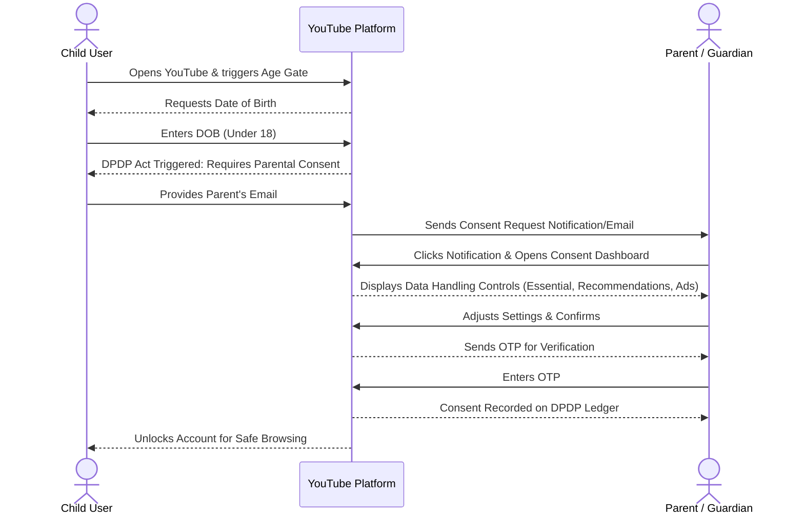

# DPDP Parental Consent Prototype

This repository contains a prototype demonstrating the user flow for parental consent under the Digital Personal Data Protection (DPDP) Act, designed for a platform like YouTube.

## 🔗 Live Prototype
[View the Interactive Prototype Here](https://dreamy-selkie-7b1222.netlify.app/)

## 🌊 User Flow Diagram

The following diagram illustrates the flow from a child attempting to use the platform to the parent granting consent:

## 🛠️ How to run locally
1. Clone this repository.
2. Open `index.html` in your web browser.
